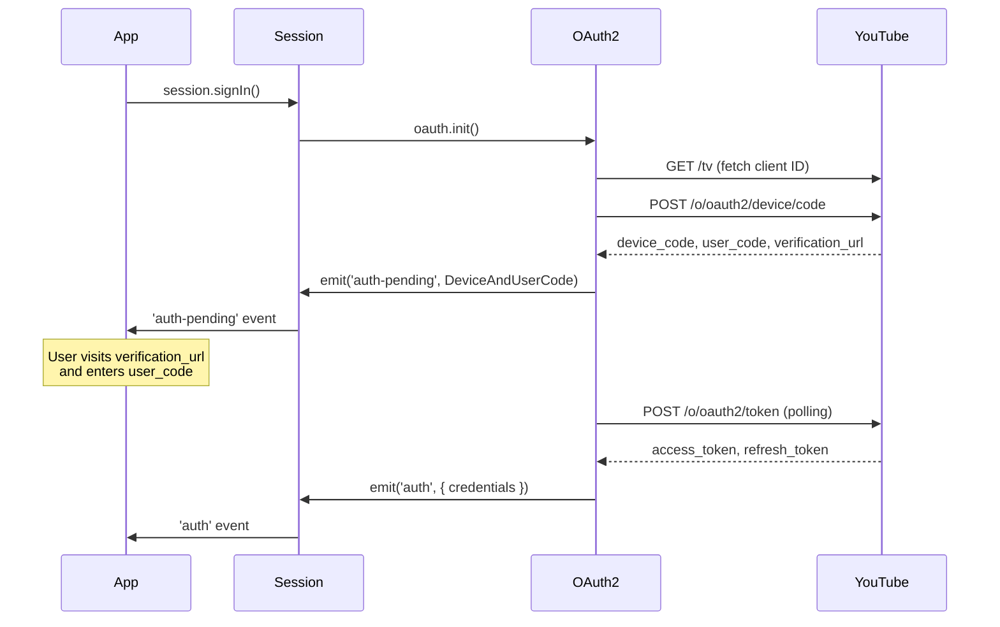

The `OAuth2` class implements YouTube's device code authentication flow, allowing your app to authenticate as a YouTube TV client without requiring a browser redirect. It handles token storage, expiry checking, refresh, and revocation.

You do not instantiate `OAuth2` directly. It is created automatically when a `Session` is constructed and is accessible via `session.oauth`. Authentication is typically triggered through `session.signIn()`.

## Authentication flow overview



## Complete example

```typescript
import { Innertube, UniversalCache } from 'youtubei.js';

const yt = await Innertube.create({ cache: new UniversalCache(true) });

yt.session.on('auth-pending', (data) => {
  console.log(`Visit: ${data.verification_url}`);
  console.log(`Enter code: ${data.user_code}`);
  console.log(`Expires in: ${data.expires_in}s`);
});

yt.session.on('auth', async ({ credentials }) => {
  console.log('Signed in successfully.');
  // Persist tokens for future sessions:
  await yt.session.oauth.cacheCredentials();
});

yt.session.on('update-credentials', async ({ credentials }) => {
  // Access token was refreshed — persist the updated tokens.
  await yt.session.oauth.cacheCredentials();
});

yt.session.on('auth-error', (err) => {
  console.error('Authentication failed:', err.message);
});

// Start the device code flow (or restore from cache):
await yt.session.signIn();

// Sign out and revoke tokens:
await yt.session.signOut();
```

---

## Methods

### `init`

```typescript
async init(tokens?: OAuth2Tokens): Promise<void>
```

Initializes the OAuth2 state. The behavior depends on whether `tokens` are provided:

- **With `tokens`**: Applies them immediately. If the access token is expired, `refreshAccessToken` is called automatically. Emits `'auth'` when ready.
- **Without `tokens`**: Checks the cache for existing credentials. If none are found, starts the full device code flow: fetches a client ID, requests a device/user code, emits `'auth-pending'`, and begins polling for the access token.

<ParamField path="tokens" type="OAuth2Tokens">
  Existing OAuth2 tokens to restore. If omitted, the device code flow is initiated.
</ParamField>

**Returns** `Promise<void>`

---

### `refreshAccessToken`

```typescript
async refreshAccessToken(): Promise<void>
```

Exchanges the current `refresh_token` for a new `access_token`. Updates `oauth2_tokens.access_token` and `oauth2_tokens.expiry_date` in place, then emits the `'update-credentials'` event on the session.

Throws `OAuth2Error` if:
- No tokens are available.
- The authorization server returns an error.
- The HTTP request fails.

**Returns** `Promise<void>`

---

### `shouldRefreshToken`

```typescript
shouldRefreshToken(): boolean
```

Returns `true` if the current access token has expired (i.e. `Date.now()` is past `expiry_date`). Returns `false` if no tokens are loaded.

**Returns** `boolean`

---

### `revokeCredentials`

```typescript
async revokeCredentials(): Promise<Response | undefined>
```

Revokes the current access token via a POST to the YouTube revocation endpoint and removes credentials from the cache. Called internally by `session.signOut()`.

**Returns** `Promise<Response | undefined>`

---

### `cacheCredentials`

```typescript
async cacheCredentials(): Promise<void>
```

Serializes the current `oauth2_tokens` to the session's cache under the key `"youtubei_oauth_credentials"`. Call this in your `'auth'` and `'update-credentials'` event handlers to persist tokens between sessions.

**Returns** `Promise<void>`

---

### `removeCache`

```typescript
async removeCache(): Promise<void>
```

Removes the cached OAuth2 credentials from the session's cache.

**Returns** `Promise<void>`

---

### `setTokens`

```typescript
setTokens(tokens: OAuth2Tokens): void
```

Applies a set of tokens to the instance. If `tokens.expires_in` is present, it is converted to an ISO `expiry_date` string. Throws `OAuth2Error` if the tokens are invalid (missing `access_token`, `refresh_token`, or `expiry_date`).

<ParamField path="tokens" type="OAuth2Tokens" required>
  The tokens to apply.
</ParamField>

**Returns** `void`

---

### `validateTokens`

```typescript
validateTokens(tokens: OAuth2Tokens): boolean
```

Returns `true` if the token object has all three required fields: `access_token`, `refresh_token`, and `expiry_date`.

<ParamField path="tokens" type="OAuth2Tokens" required>
  The token object to validate.
</ParamField>

**Returns** `boolean`

---

### `getClientID`

```typescript
async getClientID(): Promise<OAuth2ClientID>
```

Fetches the OAuth2 client ID and secret from the YouTube TV page. Called automatically during the device code flow if `client_id` is not set.

**Returns** `Promise<OAuth2ClientID>`

---

### `getDeviceAndUserCode`

```typescript
async getDeviceAndUserCode(): Promise<DeviceAndUserCode>
```

Requests a device code and user code from the authorization server. Called automatically during the device code flow.

**Returns** `Promise<DeviceAndUserCode>`

---

### `pollForAccessToken`

```typescript
pollForAccessToken(device_and_user_code: DeviceAndUserCode): void
```

Starts polling the token endpoint at the interval specified in `device_and_user_code.interval`. Stops automatically when the user approves or denies access, or when the device code expires.

<ParamField path="device_and_user_code" type="DeviceAndUserCode" required>
  The device and user code object returned by `getDeviceAndUserCode`.
</ParamField>

**Returns** `void`

---

## Types

### OAuth2Tokens

Represents a complete set of OAuth2 credentials.

<ResponseField name="access_token" type="string" required>
  The short-lived access token used to authenticate API requests.
</ResponseField>

<ResponseField name="refresh_token" type="string" required>
  The long-lived token used to obtain new access tokens.
</ResponseField>

<ResponseField name="expiry_date" type="string" required>
  ISO 8601 timestamp indicating when the access token expires (e.g. `"2026-01-01T12:00:00.000Z"`).
</ResponseField>

<ResponseField name="expires_in" type="number">
  Remaining lifetime of the access token in seconds. Present in server responses; converted to `expiry_date` and removed by `setTokens`.
</ResponseField>

<ResponseField name="scope" type="string">
  OAuth2 scope string granted by the server.
</ResponseField>

<ResponseField name="token_type" type="string">
  Token type, typically `"Bearer"`.
</ResponseField>

<ResponseField name="client" type="OAuth2ClientID">
  Optional client credentials to associate with these tokens.
  <Expandable title="properties">
    <ResponseField name="client_id" type="string" required>
      The OAuth2 client ID.
    </ResponseField>
    <ResponseField name="client_secret" type="string" required>
      The OAuth2 client secret.
    </ResponseField>
  </Expandable>
</ResponseField>

---

### OAuth2ClientID

Identifies the OAuth2 client used during authentication.

<ResponseField name="client_id" type="string" required>
  The OAuth2 client ID string.
</ResponseField>

<ResponseField name="client_secret" type="string" required>
  The OAuth2 client secret string.
</ResponseField>

---

### DeviceAndUserCode

Returned by `getDeviceAndUserCode` and passed to the `'auth-pending'` event. Contains everything needed to display the sign-in prompt to the user.

<ResponseField name="device_code" type="string" required>
  Opaque code used internally to poll for an access token. Do not display to users.
</ResponseField>

<ResponseField name="user_code" type="string" required>
  Short alphanumeric code the user enters at `verification_url`.
</ResponseField>

<ResponseField name="verification_url" type="string" required>
  The URL the user must visit to complete authentication.
</ResponseField>

<ResponseField name="expires_in" type="number" required>
  Seconds until the device and user codes expire.
</ResponseField>

<ResponseField name="interval" type="number" required>
  Minimum number of seconds to wait between token polling requests.
</ResponseField>

<ResponseField name="error_code" type="string">
  Present if the authorization server returned an error.
</ResponseField>

---

## Event handler types

### OAuth2AuthEventHandler

```typescript
type OAuth2AuthEventHandler = (data: { credentials: OAuth2Tokens }) => void;
```

Handler for the `'auth'` and `'update-credentials'` events. Receives the full token set.

---

### OAuth2AuthPendingEventHandler

```typescript
type OAuth2AuthPendingEventHandler = (data: DeviceAndUserCode) => void;
```

Handler for the `'auth-pending'` event. Receives the device and user code object so the user can be directed to the verification URL.

---

### OAuth2AuthErrorEventHandler

```typescript
type OAuth2AuthErrorEventHandler = (err: OAuth2Error) => void;
```

Handler for the `'auth-error'` event. Receives an `OAuth2Error` describing what went wrong.

---

## Properties

<ResponseField name="oauth2_tokens" type="OAuth2Tokens | undefined">
  The currently loaded OAuth2 tokens, or `undefined` if not authenticated.
</ResponseField>

<ResponseField name="client_id" type="OAuth2ClientID | undefined">
  The OAuth2 client identity (ID and secret). Fetched from the YouTube TV page during the device code flow, or set from `tokens.client`.
</ResponseField>

<ResponseField name="YTTV_URL" type="URL">
  The YouTube TV URL used to fetch the client identity (`https://www.youtube.com/tv`).
</ResponseField>

<ResponseField name="AUTH_SERVER_CODE_URL" type="URL">
  Device code endpoint (`https://www.youtube.com/o/oauth2/device/code`).
</ResponseField>

<ResponseField name="AUTH_SERVER_TOKEN_URL" type="URL">
  Token exchange and refresh endpoint (`https://www.youtube.com/o/oauth2/token`).
</ResponseField>

<ResponseField name="AUTH_SERVER_REVOKE_TOKEN_URL" type="URL">
  Token revocation endpoint (`https://www.youtube.com/o/oauth2/revoke`).
</ResponseField>
